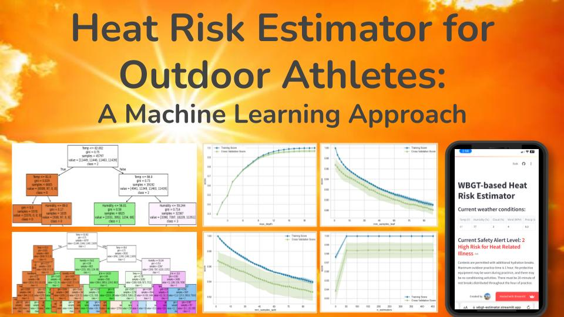

<!--
## WBGT-based Heat Risk Estimation for Outdoor Athletes: A Machine Learning Approach
-->

  

It has been very hot in recent years. The year 2024 was the hottest year in history, and this year is expected to be pretty hot again. These high temperatures bring risk for heat-related illnesses, which can cause death if not taken seriously. Unfortunately, ER and death rates have been increasing due to this illness. In the US, at least 77 athletes have died since 2000, and 65 of them were teenagers. This is a major humanity issue worldwide, not only in the US, because these deaths are avoidable with the right precautions. 

The goals of this project are to help athletes and coaches to be aware of the heat risk of their activity and help them take precautions early. To meet these goals, this project proposes a method to estimate safety alert level with common meteorological parameters. It uses machine learning to classify a set of meteorological parameters to an alert level.

This project uses decision tree and random forest algorithms for classification. The classifiers use air temperature, humidity, cloud cover, precipitation and local time as inputs. The classification output is a safety alert level. Four different alert levels are adopted from a standard heat safety policy that is endorsed by the National Federation of State High School Associations.

The proposed classifiers are trained and evaluated with a dataset from the National Oceanic and Atmospheric Administration. After performing dataset preprocessing and hyperparameter tuning, the decision tree accuracy is 91% and the random forest accuracy is 99%. They are efficient and lightweight enough to be deployed in webapps. Currently, a simple proof-of-concept webapp is running at [https://wbgt-estimator.streamlit.app](https://wbgt-estimator.streamlit.app/), which takes the current weather conditions and estimates the safety alert level.  

Future work includes enhancing the proposed classifiers with extra datasets and carrying out field tests in the summer. Webapp improvement and smartphone app development are also planned. 

This project was submitted to the [Hack for Humanity 2025](https://hack-for-humanity-25.devpost.com/). 

